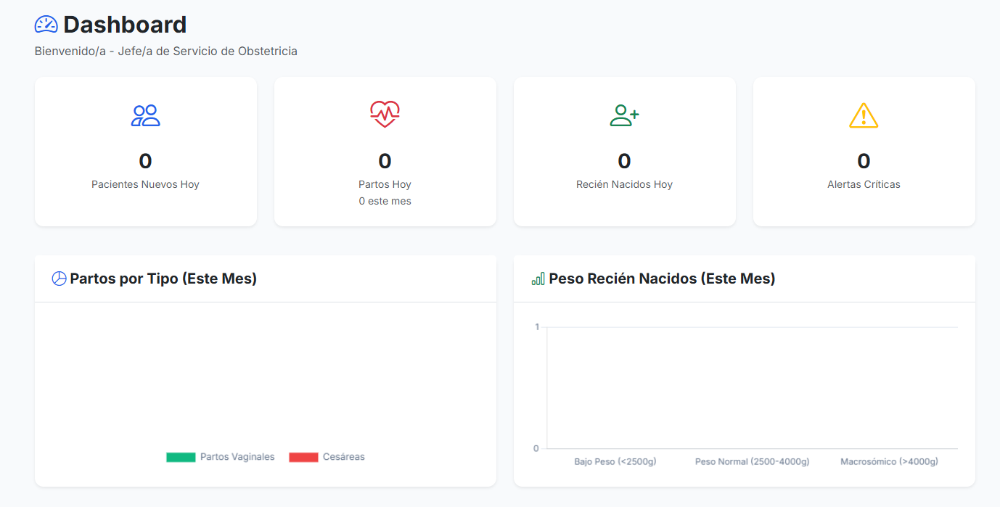
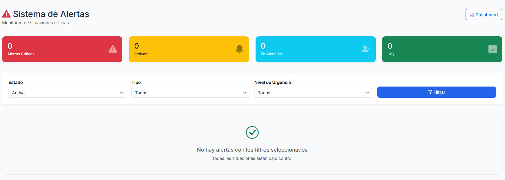
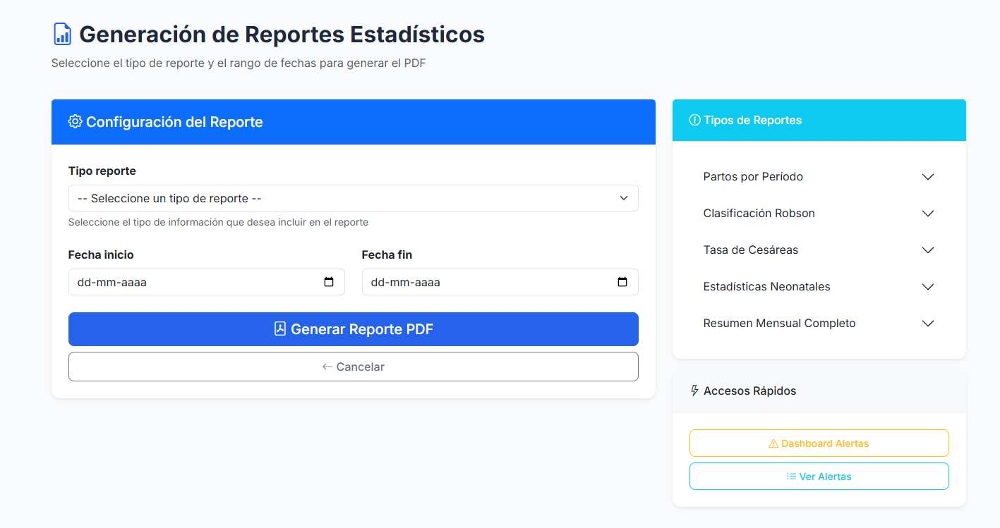
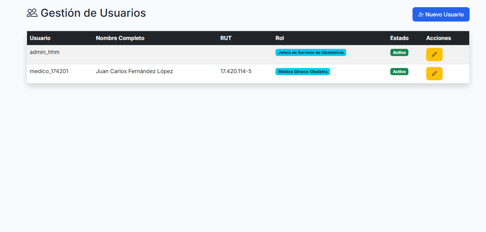
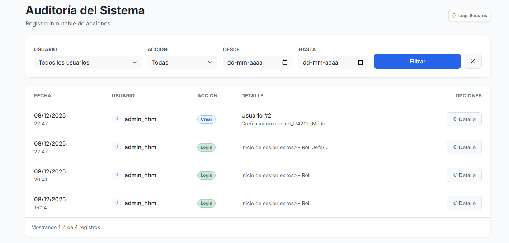

# V. ENFOQUE TÉCNICO: "¿CÓMO?" - PARTE 1
## ANÁLISIS DE REQUERIMIENTOS Y DISEÑO DE INTERFACES

---

## **5.1 ANÁLISIS DE REQUERIMIENTOS**

### **5.1.1 REVISIÓN DE REQUERIMIENTOS FUNCIONALES**

El equipo realizó un análisis de los requerimientos del sistema de gestión obstétrica basado en las necesidades identificadas en unidades anteriores, enfocándose en las funcionalidades críticas para el Hospital Herminda Martín.

#### **Requerimientos Funcionales Principales**

**RF-001: Gestión de Pacientes**
- Registro de pacientes madres con datos demográficos completos
- Validación de RUT chileno con dígito verificador
- Almacenamiento de información de contacto y antecedentes
- Búsqueda eficiente de pacientes por RUT o nombre

**RF-002: Control Prenatal**
- Registro de controles prenatales con fechas y datos clínicos
- Seguimiento de antecedentes obstétricos (gestas, partos, cesáreas)
- Registro de exámenes de laboratorio (hemoglobina, glicemia)
- Control de patologías del embarazo

**RF-003: Registro de Parto**
- Formulario completo de registro de parto
- Clasificación automática según criterios médicos
- Registro de profesionales responsables
- Documentación de complicaciones y procedimientos

**RF-004: Evaluación Neonatal**
- Registro de datos del recién nacido
- Evaluación APGAR estructurada
- Antropometría (peso, talla, circunferencia craneana)
- Registro de procedimientos neonatales

**RF-005: Sistema de Usuarios y Seguridad**
- Autenticación con RUT y contraseña
- Control de acceso basado en roles
- Auditoría de acciones del sistema
- Protección de datos sensibles
### **5.1.2 REQUERIMIENTOS NO FUNCIONALES**

Basado en las necesidades del entorno hospitalario, se identificaron los siguientes requerimientos no funcionales:

#### **RNF-001: Rendimiento**
- Tiempo de respuesta rápido para operaciones frecuentes
- Carga eficiente de formularios complejos
- Búsqueda ágil de pacientes
- Soporte para múltiples usuarios simultáneos

#### **RNF-002: Disponibilidad**
- Sistema disponible durante horarios de operación hospitalaria
- Respaldos automáticos de información crítica
- Recuperación ante fallos del sistema
- Mantenimiento programado fuera de horarios críticos

#### **RNF-003: Seguridad**
- Autenticación segura de usuarios
- Control de acceso basado en roles médicos
- Protección de datos sensibles de pacientes
- Auditoría de acciones del sistema

#### **RNF-004: Usabilidad**
- Interfaces intuitivas para personal médico
- Diseño responsivo (desktop/tablet)
- Terminología médica estándar
- Navegación simple entre módulos
- Diseño responsive (desktop/tablet)
- Accesibilidad WCAG 2.1 nivel AA

Idioma y Localización:
- Español chileno
- Terminología médica estándar
- Formato fechas DD/MM/YYYY
- RUT chileno con validación DV

---

## **5.2 DISEÑO DE INTERFACES DE USUARIO**

### **5.2.1 ARQUITECTURA DE INTERFACES**

El diseño de interfaces se basa en Django Templates con Bootstrap 5, priorizando usabilidad médica y responsividad para el entorno hospitalario.

#### **Templates Base Implementados**

**`base.html`** - Estructura Principal
- Layout responsivo con navegación contextual
- Sistema de alertas médicas integrado
- Breadcrumbs para orientación en workflow
- Footer con información del sistema
- Integración Bootstrap 5 y librerías CSS médicas

**Navegación por Roles**
- Menú diferenciado según perfil de usuario (médico, matrona, admin)
- Acceso rápido a funciones críticas (buscar paciente, registros urgentes)
- Indicadores visuales de pacientes pendientes
- Alertas de sistema visibles en todas las vistas

#### **Interfaces Principales del Sistema**

**1. Dashboard General (`general/dashboard.html`)**
- Resumen de actividad diaria del servicio
- Indicadores de pacientes en atención
- Alertas médicas prioritarias
- Accesos directos a funciones frecuentes
- Estadísticas básicas del turno

**2. Gestión de Pacientes (`pacientes/buscar.html`)**
- Búsqueda por RUT con validación en tiempo real
- Lista de pacientes obstétricas activas
- Filtros por estado de embarazo y urgencia
- Vista de resumen con datos críticos
- Navegación directa a registros médicos

**3. Registro de Parto (`obstetricia/registrar_parto.html`)**
- Formulario estructurado por etapas del parto
- Campos con validación médica automática
- Guardado de progreso automático
- Diseño optimizado para uso en tablet
- Cálculos obstétricos automatizados

**4. Evaluación Neonatal (`neonatologia/registrar_rn.html`)**
- Interfaz APGAR con alertas visuales
- Formulario de antropometría neonatal
- Registro de procedimientos y observaciones
- Alertas automáticas para valores críticos
- Acceso rápido para situaciones de emergencia

### **5.2.2 PRINCIPIOS DE DISEÑO APLICADOS**

#### **Usabilidad Médica**
- **Terminología Estándar**: Uso de nomenclatura médica reconocida
- **Workflow Intuitivo**: Secuencia lógica basada en protocolos clínicos
- **Validación Preventiva**: Campos con rangos médicos apropiados
- **Acceso Rápido**: Funciones críticas accesibles en máximo 2 clics

#### **Responsividad y Accesibilidad**
- **Bootstrap 5**: Framework responsivo para múltiples dispositivos
- **Viewport Optimizado**: Diseño efectivo en desktop y tablet
- **Contraste Médico**: Colores apropiados para entorno hospitalario
- **Tipografía Clara**: Fuentes legibles bajo stress y cansancio

#### **Consistencia Visual**
- **Paleta de Colores**: Esquema hospitalario profesional
- **Iconografía Médica**: Íconos reconocibles para personal de salud
- **Layout Uniforme**: Estructura consistente en todos los módulos
- **Estados Visuales**: Indicadores claros para diferentes estados de datos

### **5.2.3 COMPONENTES DE INTERFAZ ESPECÍFICOS**

#### **Formularios Médicos**
- **Validación en Tiempo Real**: Verificación inmediata de rangos clínicos
- **Auto-completado Inteligente**: Sugerencias basadas en historial
- **Guardado Automático**: Preservación de datos cada 30 segundos
- **Indicadores de Progreso**: Visualización del completado del registro

#### **Alertas y Notificaciones**
- **Alertas Críticas**: Notificaciones para valores APGAR < 7
- **Alertas Informativas**: Recordatorios de campos obligatorios
- **Estados del Sistema**: Indicadores de conexión y guardado
- **Validaciones**: Mensajes claros para corrección de errores

#### **Búsqueda y Filtrado**
- **Búsqueda por RUT**: Validación automática de formato chileno
- **Filtros Médicos**: Criterios relevantes (semana gestacional, riesgo)
- **Resultados Estructurados**: Información crítica destacada
- **Navegación Rápida**: Acceso directo a registros desde resultados

---

## **5.3 CONSIDERACIONES TÉCNICAS DE IMPLEMENTACIÓN**

### **5.3.1 ESTÁNDARES DE DESARROLLO**

#### **Framework Frontend**
- **Django Templates**: Sistema de plantillas nativo para renderizado del lado del servidor
- **Bootstrap 5**: Framework CSS para diseño responsivo y componentes UI
- **JavaScript Nativo**: Funcionalidades interactivas sin dependencias externas pesadas
- **CSS Personalizado**: Estilos específicos para entorno médico hospitalario

#### **Validaciones de Datos**
- **Django Forms**: Validación del lado del servidor para seguridad
- **JavaScript**: Validación del lado del cliente para UX inmediata
- **Rangos Médicos**: Valores apropiados para datos antropométricos y clínicos
- **Formato RUT**: Validación específica para identificación chilena

#### **Manejo de Estados**
- **Sesiones Django**: Manejo seguro del estado del usuario
- **LocalStorage**: Guardado temporal de formularios en progreso
- **CSRF Protection**: Protección contra ataques de falsificación
- **Timeouts**: Gestión automática de sesiones expiradas

### **5.3.2 FLUJOS DE TRABAJO PRINCIPALES**

#### **Flujo de Registro de Parto**
1. **Búsqueda de Paciente**: Localización por RUT o nombre
2. **Validación de Datos**: Verificación de información prenatal
3. **Registro Progresivo**: Captura por etapas del proceso
4. **Validación Médica**: Verificación de rangos clínicos
5. **Confirmación**: Revisión final y guardado permanente

#### **Flujo de Evaluación Neonatal**
1. **Acceso Directo**: Desde registro de parto o búsqueda independiente
2. **Datos Básicos**: Información demográfica del recién nacido
3. **Evaluación APGAR**: Registro estructurado con alertas automáticas
4. **Antropometría**: Peso, talla, circunferencia craneana
5. **Procedimientos**: Registro de intervenciones neonatales

#### **Flujo de Consulta y Reportes**
1. **Selección de Criterios**: Filtros de búsqueda médica
2. **Generación de Datos**: Consulta optimizada a base de datos
3. **Visualización**: Presentación clara de resultados
4. **Exportación**: Formato compatible con sistemas ministeriales

---

## **5.3 EJEMPLOS DE INTERFACES IMPLEMENTADAS**

### **5.3.1 PANTALLAS DEL SISTEMA**

A continuación se presentan ejemplos visuales de las interfaces de usuario implementadas en el Sistema de Gestión Obstétrica, desarrolladas con Django Templates y Bootstrap 5.

#### **Interfaz 1**

  

#### **Interfaz 2**

  

#### **Interfaz 3**

  

#### **Interfaz 4**

  

#### **Interfaz 5**

  

### **5.3.2 CONSIDERACIONES DE DISEÑO**

Las interfaces presentadas demuestran la implementación de los principios de usabilidad médica y diseño responsivo utilizando Bootstrap 5, priorizando la eficiencia en los flujos de trabajo del personal hospitalario del Hospital Herminda Martín.

---