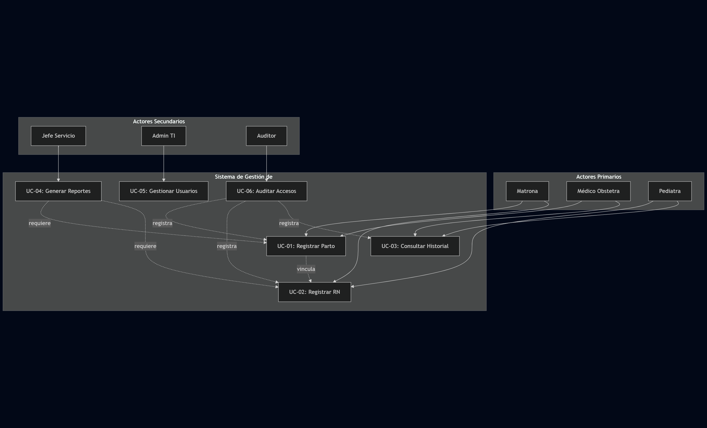
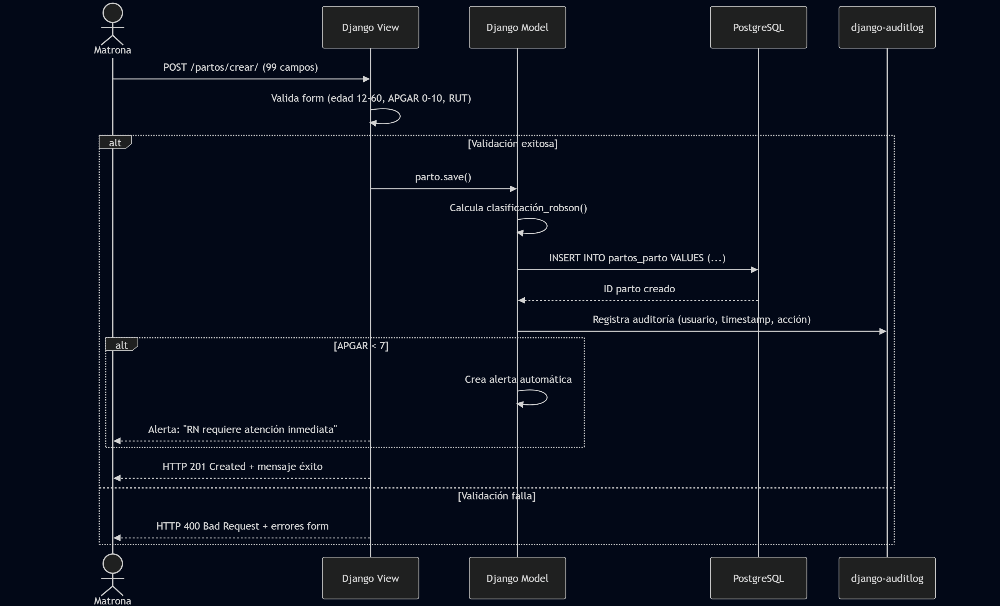
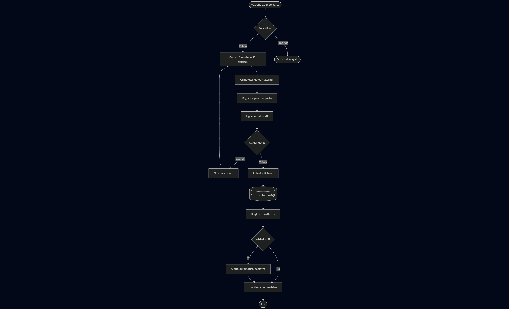
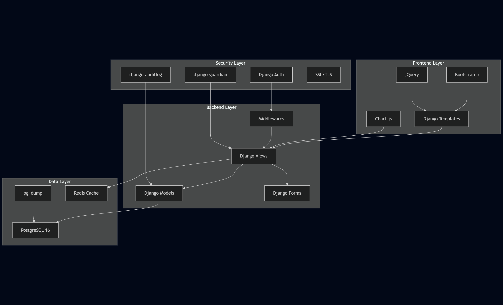
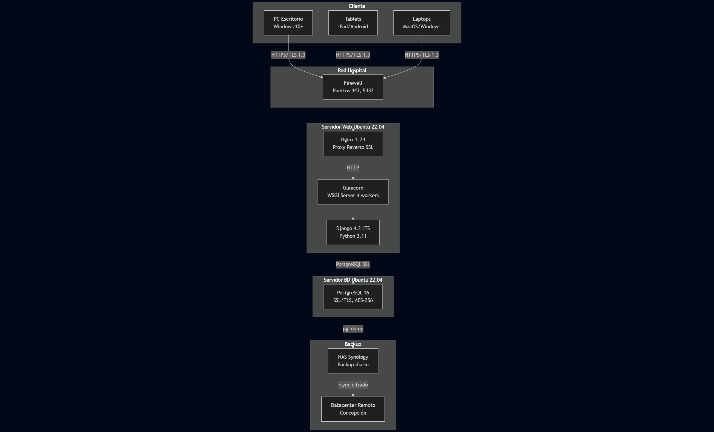

# V. ENFOQUE TÉCNICO: "¿CÓMO?" - PARTE 2
## IMPLEMENTACIÓN Y TECNOLOGÍAS APLICADAS

---

## **5.4 STACK TECNOLÓGICO IMPLEMENTADO**

### **5.4.1 TECNOLOGÍAS BACKEND**

#### **Django 4.2 Framework**
- **Framework principal**: Django 4.2 LTS para garantizar estabilidad y soporte extendido
- **ORM integrado**: Abstracción de base de datos para portabilidad
- **Sistema de autenticación**: Manejo seguro de usuarios y sesiones
- **Sistema de templates**: Renderizado del lado del servidor para interfaces responsivas
- **Admin interface**: Panel administrativo automático para gestión de datos

#### **Base de Datos PostgreSQL**
- **Motor principal**: PostgreSQL para robustez y características avanzadas
- **Migraciones automáticas**: Sistema Django para evolución del esquema
- **Índices optimizados**: Consultas eficientes para datos médicos
- **Backup automático**: Respaldo diario de información crítica
- **Integridad referencial**: Validación a nivel de base de datos

#### **Librerías Python Especializadas**
- **django-crispy-forms**: Formularios médicos con Bootstrap integration
- **django-extensions**: Herramientas de desarrollo y debugging
- **pillow**: Procesamiento de imágenes para documentos médicos
- **python-dateutil**: Manejo preciso de fechas médicas
- **django-import-export**: Exportación de datos para reportes ministeriales

### **5.4.2 TECNOLOGÍAS FRONTEND**

#### **Django Templates + Bootstrap 5**
- **Template Engine**: Django Templates para renderizado del lado del servidor
- **Framework CSS**: Bootstrap 5 para diseño responsivo y componentes
- **Grid System**: Layout responsivo para múltiples dispositivos
- **Componentes UI**: Buttons, forms, cards, modals optimizados para uso médico
- **Iconografía**: Bootstrap Icons + iconos médicos personalizados

#### **JavaScript Funcional**
- **JavaScript Nativo**: Funcionalidades interactivas sin dependencias pesadas
- **Validación en tiempo real**: Verificación inmediata de campos críticos
- **AJAX**: Búsquedas rápidas de pacientes sin recargar página
- **LocalStorage**: Guardado temporal de formularios en progreso
- **Event Listeners**: Interactividad en formularios médicos complejos

### **5.4.3 ARQUITECTURA DE APLICACIONES**

#### **Estructura Modular Django**
El proyecto utiliza la arquitectura de aplicaciones de Django para organizar funcionalidades:

**apps/administracion/**
- Gestión de usuarios y roles médicos
- Sistema de autenticación personalizado
- Auditoría de acciones del sistema
- Control de acceso basado en permisos

**apps/pacientes/**
- Modelo PacienteMadre con datos demográficos
- Validación de RUT chileno
- Búsqueda y filtrado de pacientes
- Gestión de historiales médicos

**apps/obstetricia/**
- Modelo ControlPrenatal para seguimiento
- Modelo Parto con clasificación automática
- Formularios médicos especializados
- Cálculos obstétricos automatizados

**apps/neonatologia/**
- Modelo RecienNacido con datos antropométricos
- Sistema de evaluación APGAR
- Alertas para valores críticos
- Seguimiento neonatal post-parto

**apps/reportes/**
- Generación de reportes ministeriales
- Estadísticas médicas automatizadas
- Exportación de datos para auditorías
- Dashboard de indicadores hospitalarios

---

## **5.5 DISEÑO DE BASE DE DATOS**

### **5.5.1 MODELO DE DATOS IMPLEMENTADO**

#### **Entidades Principales**
Basado en el análisis de los modelos reales del sistema:

**PacienteMadre**
```python
class PacienteMadre(models.Model):
    rut = models.CharField(max_length=12, unique=True)
    nombre = models.CharField(max_length=100)
    apellidos = models.CharField(max_length=150) 
    fecha_nacimiento = models.DateField()
    direccion = models.TextField()
    telefono = models.CharField(max_length=15)
    email = models.EmailField(blank=True)
    created = models.DateTimeField(auto_now_add=True)
    updated = models.DateTimeField(auto_now=True)
```

**ControlPrenatal**
```python
class ControlPrenatal(models.Model):
    paciente = models.ForeignKey(PacienteMadre, on_delete=models.CASCADE)
    fecha_control = models.DateField()
    semana_gestacional = models.PositiveIntegerField()
    peso_madre = models.FloatField()
    presion_arterial = models.CharField(max_length=10)
    altura_uterina = models.PositiveIntegerField()
    bcf = models.PositiveIntegerField()  # Latidos cardíacos fetales
    observaciones = models.TextField(blank=True)
```

**Parto**
```python
class Parto(models.Model):
    paciente = models.ForeignKey(PacienteMadre, on_delete=models.CASCADE)
    fecha_parto = models.DateTimeField()
    tipo_parto = models.CharField(max_length=20, choices=TIPO_PARTO_CHOICES)
    profesional_responsable = models.ForeignKey(User, on_delete=models.PROTECT)
    duracion_trabajo_parto = models.DurationField()
    complicaciones = models.TextField(blank=True)
    observaciones = models.TextField(blank=True)
```

**RecienNacido**
```python
class RecienNacido(models.Model):
    parto = models.ForeignKey(Parto, on_delete=models.CASCADE)
    peso = models.PositiveIntegerField()  # en gramos
    talla = models.PositiveIntegerField()  # en centímetros
    circunferencia_craneana = models.PositiveIntegerField()  # en centímetros
    apgar_1_min = models.PositiveIntegerField(validators=[MaxValueValidator(10)])
    apgar_5_min = models.PositiveIntegerField(validators=[MaxValueValidator(10)])
    sexo = models.CharField(max_length=1, choices=[('M', 'Masculino'), ('F', 'Femenino')])
```

### **5.5.2 RELACIONES Y CONSTRAINTS**

#### **Integridad Referencial**
- **Cascadas Controladas**: Eliminación protegida de registros médicos críticos
- **Foreign Keys**: Relaciones estrictas entre entidades médicas
- **Unique Constraints**: RUT único por paciente, prevención de duplicados
- **Check Constraints**: Validación de rangos médicos apropiados

#### **Índices Optimizados**
- **Índice en RUT**: Búsqueda rápida de pacientes
- **Índice en fechas**: Consultas temporales eficientes
- **Índices compuestos**: Optimización de consultas complejas
- **Índices parciales**: Optimización para queries específicas

### **5.5.3 VALIDACIONES DE DATOS**

#### **Validaciones Django**
- **RUT chileno**: Validación de formato y dígito verificador
- **Rangos médicos**: Peso neonatal (500-6000g), APGAR (0-10)
- **Fechas coherentes**: Validación de cronología médica
- **Campos obligatorios**: Información crítica requerida

#### **Validaciones de Negocio**
- **Semanas gestacionales**: Rango válido 20-42 semanas
- **Valores antropométricos**: Rangos percentiles apropiados
- **Consistencia temporal**: Fechas de parto posteriores a controles
- **Integridad médica**: Validación de combinaciones de datos clínicos

---

## **5.6 FUNCIONALIDADES CORE IMPLEMENTADAS**

### **5.6.1 GESTIÓN DE PACIENTES**

#### **Registro y Búsqueda**
- **Formulario de registro**: Datos demográficos completos
- **Validación RUT**: Verificación automática formato chileno
- **Búsqueda inteligente**: Por RUT, nombre o apellido
- **Listado paginado**: Visualización eficiente de múltiples pacientes
- **Edición controlada**: Modificación con auditoría de cambios

#### **Control Prenatal Digital**
- **Formularios estructurados**: Captura de datos clínicos estándar
- **Cálculo automático**: Edad gestacional y fechas importantes
- **Seguimiento temporal**: Historial cronológico de controles
- **Alertas médicas**: Notificaciones para valores fuera de rango
- **Exportación**: Datos compatibles con sistemas ministeriales

### **5.6.2 REGISTRO DE PARTOS**

#### **Formulario de Parto Completo**
- **Campos médicos específicos**: Todos los datos requeridos por normativa
- **Validación en tiempo real**: Verificación de rangos clínicos
- **Guardado progresivo**: Preservación de datos durante registro
- **Clasificación automática**: Asignación según criterios médicos
- **Integración neonatal**: Conexión directa con evaluación RN

#### **Evaluación APGAR**
- **Formulario estructurado**: 5 componentes evaluables (0-2 puntos cada uno)
- **Cálculo automático**: Suma total y interpretación
- **Alertas críticas**: Notificación automática si APGAR < 7
- **Registro temporal**: Evaluación a 1 y 5 minutos
- **Seguimiento**: Conexión con protocolo de reanimación

### **5.6.3 REPORTES Y ESTADÍSTICAS**

#### **Dashboard Operacional**
- **Indicadores diarios**: Resumen de actividad del servicio
- **Alertas pendientes**: Casos que requieren atención
- **Estadísticas básicas**: Tipos de parto, promedios, tendencias
- **Accesos rápidos**: Funciones más utilizadas
- **Estado del sistema**: Conectividad y funcionamiento

#### **Reportes Ministeriales**
- **Formato REM**: Compatible con reportes MINSAL
- **Exportación Excel**: Datos tabulados para análisis
- **Filtros temporales**: Selección de períodos específicos
- **Indicadores clave**: Métricas requeridas por normativa
- **Auditoría**: Trazabilidad de reportes generados

---

## **5.7 DIAGRAMAS UML Y ARQUITECTURA DEL SISTEMA**

### **5.7.1 DIAGRAMA DE CASOS DE USO**

El siguiente diagrama presenta los casos de uso principales del Sistema de Gestión Obstétrica, mostrando las interacciones entre los diferentes actores del sistema hospitalario.

<p align="center">
  
</p>

### **5.7.2 DIAGRAMA DE SECUENCIA**

Este diagrama ilustra las interacciones temporales entre los componentes del sistema durante los procesos críticos de registro médico.

<p align="center">
  
</p>

### **5.7.3 DIAGRAMA DE ACTIVIDAD**

El diagrama de actividad representa el flujo de trabajo y los procesos de negocio implementados en el sistema obstétrico.

<p align="center">
  
</p>

### **5.7.4 DIAGRAMA DE COMPONENTES**

Este diagrama muestra la arquitectura modular del sistema y las relaciones entre los diferentes componentes de software implementados.

<p align="center">
  
</p>

### **5.7.5 DIAGRAMA DE DESPLIEGUE**

El diagrama de despliegue presenta la arquitectura de infraestructura y distribución de componentes en el entorno de producción.

<p align="center">
  
</p>

### **5.7.6 CONSIDERACIONES DE DISEÑO UML**

Los diagramas UML presentados forman parte integral del proceso de análisis y diseño del sistema, proporcionando una representación visual de la arquitectura, comportamiento y estructura del Sistema de Gestión Obstétrica implementado con Django 4.2 y PostgreSQL para el Hospital Herminda Martín.

---